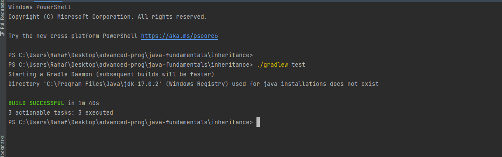

- [Overview](#overview)
- [Classes](#classes)
- [Testing](#testing) 

# Project Overview

This project includes three main classes:
- `Shop`: Represents a shop with a name, description, and dollar sign count.
- `Theater`: Represents a theater with a name and a list of movies.
- `Review`: Represents a review with a body, author, stars, and the reviewed entity (Shop, Theater, or Restaurant).

## Classes

### Shop

The `Shop` class has the following attributes:
- `name`: Name of the shop.
- `description`: Description of the shop.
- `dollarSigns`: Number of dollar signs representing the price range.

### Theater

The `Theater` class has the following attributes:
- `name`: Name of the theater.
- `movies`: List of movies currently showing.

### Review

The `Review` class has the following attributes:
- `body`: Body of the review.
- `author`: Author of the review.
- `stars`: Number of stars given in the review.
- `restaurant` (optional): Associated restaurant for the review.
- `shop` (optional): Associated shop for the review.
- `theater` (optional): Associated theater for the review.
- `movie` (optional): Movie seen in the theater (if applicable).

## Testing

To test the classes, follow these steps:
1. Compile the code using `javac Testing.java`.
2. Run the compiled program using `java Testing`.

